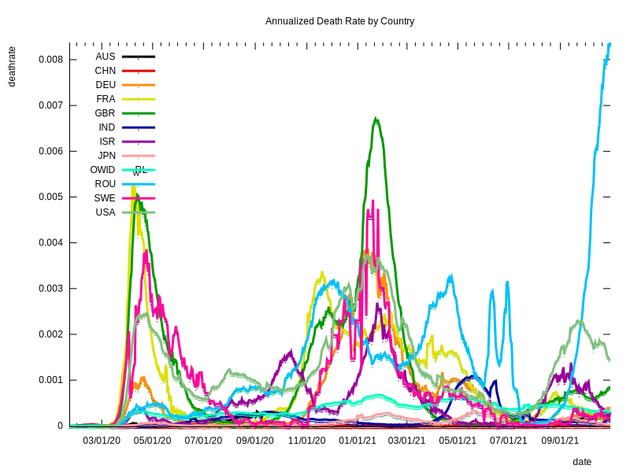
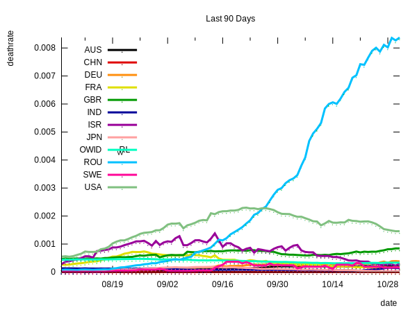
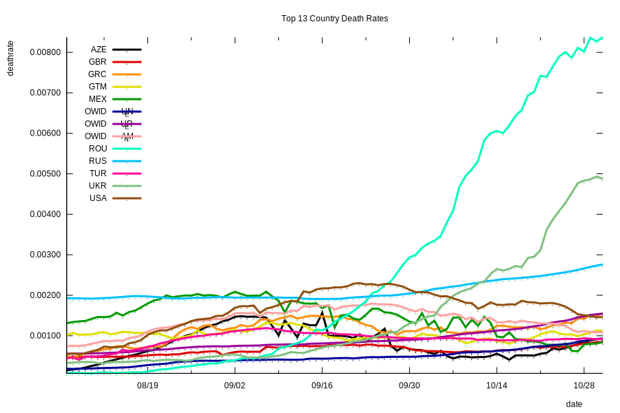
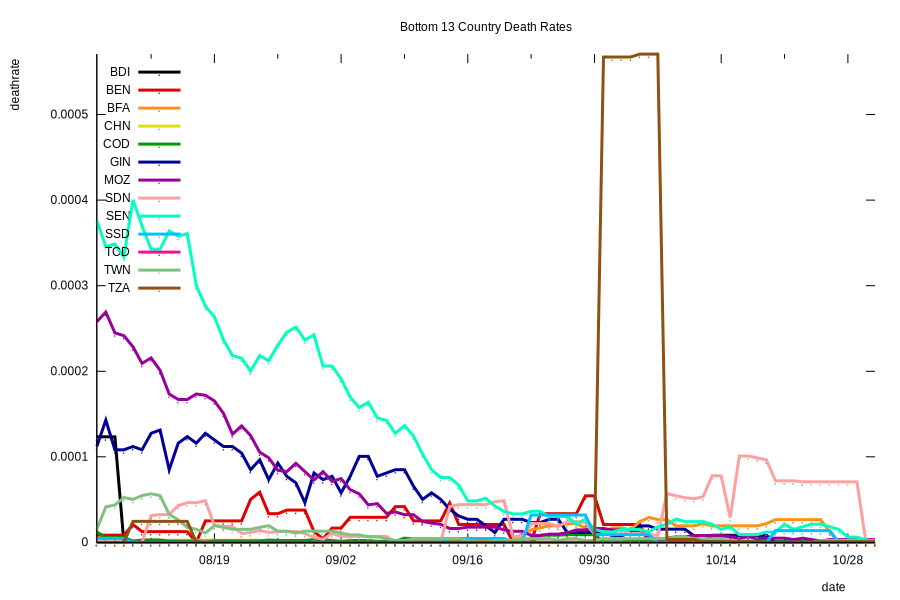
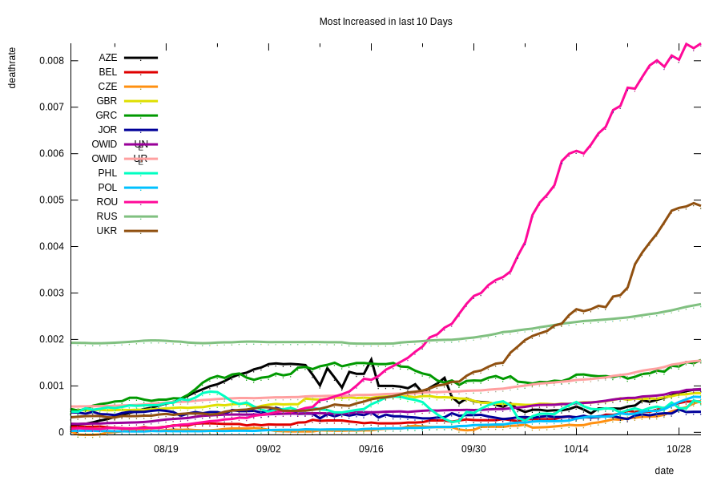
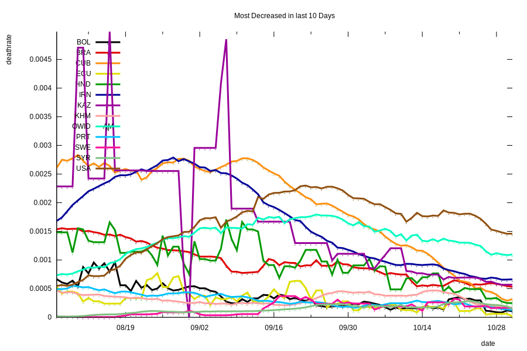

# coronavirus
Analysis of Corona Virus Data
The [code used to produce this report](https://github.com/eichblatt/coronavirus) use my kdb library to download daily coronavirus data by state in the USA, and plot it from various perspectives.
I did this mostly as a way to build up the kdb library's functionality as I asked questions of the data.

## World Data

# [Death Trends](./country_trends.svg)
 

# [Recent Death Trends](./recent_country_trends.svg)
 

# [Countries With Highest Mortality](./worst10_countries.svg)
 

# [Countries With Lowest Mortality](./best10_countries.svg)
 

# [Countries With Most Increased Mortality](./most_increased_country.svg)
 

# [Countries With Most Decreased Mortality](./most_decreased_country.svg)
 

## USA Data (until March 2021)

# [Death Trends](./death_trends.svg) 
 
  
# [Recent Death Trends](./recent_death_trends.svg)
 
 
# [States With Highest Mortality](./worst10.svg) 
 

# [States With Lowest Mortality](./best10.svg) 
 

# [States With Most Increased Mortality](./most_increased.svg) 
 
 
# [States With Most Decreased Mortality](./most_decreased.svg) 
 
 
# [Total Excess Mortality](./excess_by_state.svg) 
 Excess Mortality is integrated over the entire Covid pandemic. Excess Mortality is defined 
 ```
 $\frac{Total Covid Deaths}{Annual Deathrate * population } * \frac{Days of Pandemic}{365}$
 ```
 An excess mortality of 0.2 would mean that the 
 death rate has increased by 20% due to Covid 19.
 


# About the Data

The Covid death rates are annualized daily 7-day moving average death per person in the population of the state or region. Eg. it is 365 * the daily death rate. 

Daily Covid data for the United States from [https://covidtracking.com/](https://covidtracking.com)

US Population and non-covid death rates from [the US census website](https://www.census.gov/programs-surveys/popest.html)

World Population and covid death rates from [Our World In Data](https://ourworldindata.org/covid-deaths)


Report Updated at 2021.09.24 08:44:21 EST
