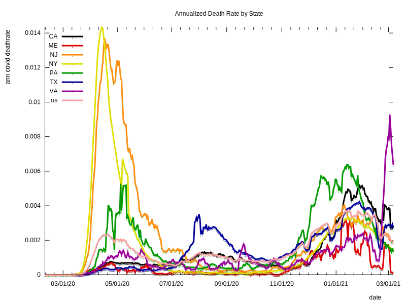

# coronavirus
Analysis of Corona Virus Data
The [code used to produce this report](https://github.com/eichblatt/coronavirus) use my kdb library to download daily coronavirus data by state in the USA, and plot it from various perspectives.
I did this mostly as a way to build up the kdb library's functionality as I asked questions of the data.

# [Death Trends](./death_trends.svg) 
 
  
# [Recent Death Trends](./recent_death_trends.svg)
 
 
# [States With Highest Mortality](./worst10.svg) 
 

# [States With Lowest Mortality](./best10.svg) 
 

# [States With Most Increased Mortality](./most_increased.svg) 
 
 
# [States With Most Decreased Mortality](./most_decreased.svg) 
 
 
# [Excess Mortality](./excess_by_state.svg) 
 Excess Mortality is defined as what fraction of the typical death rate is attrituable to the Covid 19. An excess mortality of 0.2 would mean that the 
 death rate has increased by 20% due to Covid 19.
 
 

# About the Data

The Covid death rates are annualized daily death per person in the population of the state or region. Eg. it is 365 * the daily death rate. 

Daily Covid data for the United States from [https://covidtracking.com/](https://covidtracking.com)

Population and non-covid death rates from [the US census website](https://www.census.gov/programs-surveys/popest.html)

Report Updated at 2021.01.14 17:53:42 EST
